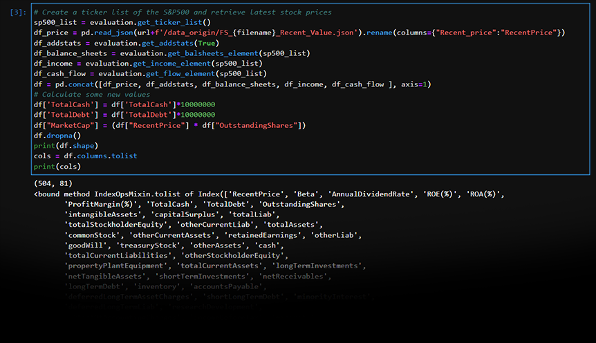
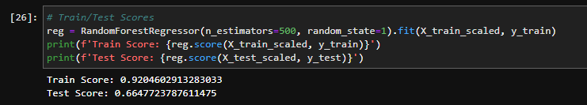
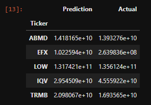
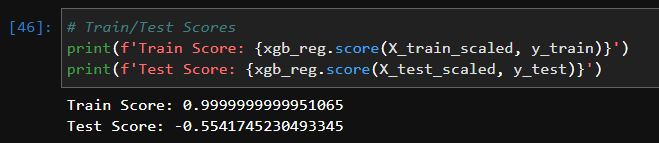
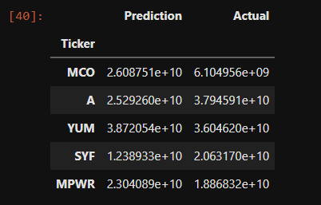
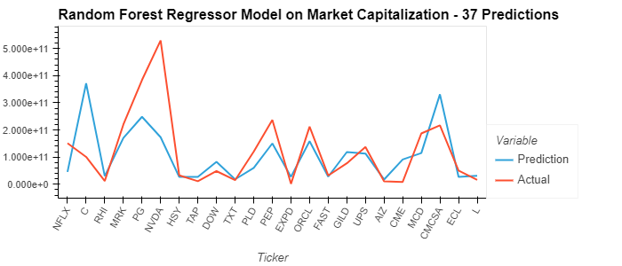
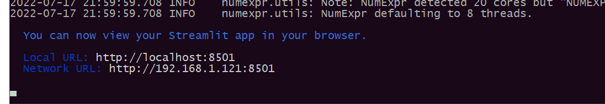
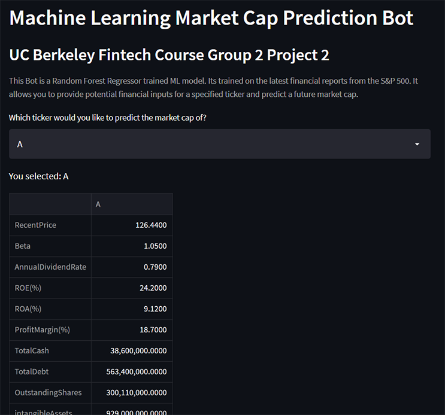

# Valuation Bot

ValuationBot allows users to conduct company valuation predictions based on fundamental analysis in seconds.

This project uses public financial statement data to train machine learning models which return solid valuation predictions. ValuationBot is a web-based application which runs a Python kernel in a Streamlit App. The goal of the project is to deliver an appl that will reduce the time spent on fundamental analysis by both financial professionals and the end investor.
 
## Process

Our ETL is an improvised series of processes that entails ingesting data, processing it to ensure usability, and storing it in a secure and accessible location.

* Extract - Read origin data from filesystem `/origin_data` to examine characteristics. Save into a separate directory `/data`
* Transform - Calculate available non-nulls, invalid floats, etc and impute as necessary.
* Load - Load the various versions of the processed data into models for analysis and comparison.

## Data Extraction

From Kaggle.com, we chose this dataset because of the curated company statistics and other indicators.  Ther are balance sheets, cash flow & income reports, and recent value datasets. 

source: [https://www.kaggle.com/datasets/hanseopark/sp-500-stocks-value-with-financial-statement](https://www.kaggle.com/datasets/hanseopark/sp-500-stocks-value-with-financial-statement)

To prepare the data, we used a few existing functions from a notebook that merged existing company Quarterly financial data from the `/data_origin` folder.

We merged these reports into a single dataframe and ran a correlation matrix to examine the results. After all filtering without imputing the data, we were left with about 119 companies from which to create a model. We've expored the possibility of creating a model with this data and found too many null values for the full 500 tickers to be included. Many tickers were missing so much info, that there were dropped altogether. We trimmed as little as possible and filled a few remaining slots with thier columns' mean (which would skew things, but we're low on options).

Market Capitalization for ML modal prediction on our tiny dataset would require additional data. We proceeded to calculate MarketCap from the available `outstanding_shares` column in the origin data.  This was done in an earlier step sin there were only 15 compamnies that had a non-null MarketCap. So we just generated it from the other columns for the remaining companies.

At the end of the Extraction phase, we have `500x81` of usable data.



We calculated the percentages of null values across rows and columns. After the Transformation phase, we were left with `152x68` - a challange to build a usable model, but not impossible.

*A separate dataset was created and maintained to include [**market sector**](data/sp500_Wsector1.6.csv) info.  Not all were available at the time.  But we would like to continue to explore expanding this data.*


## Model Training

To predict MarketCap, we created a Linear Regression model. So we split the data for training and testing at a 30/70 split to start off.

With a quick test on a Linear Regression model, the predictions are good, but not great.

            Prediction	Actual
        0	2.236037e+10	2.192102e+10
        1	1.169874e+11	1.007215e+11
        2	1.794584e+11	2.257415e+10

### Neural Network

 * [3_analysis_NN_model.ipynb](3_analysis_NN_model.ipynb)

### Random Forest Regressor

 * [2_analysis_RFR_model.ipynb](2_analysis_RFR_model.ipynb)
 * 
 * 


### XGBoost

 * [2_analysis_XGB_model.ipynb](2_analysis_XGB_model.ipynb)
 * 
 * 

---

## Functionality and Web UI

The program starts by importing financial statement data located in csv files(located under data folder). Then, it utilizes this data to train a Random Forest Regression ML model(located in 2_analysis_RFR_model.ipynb). Subsequently, the training data is passed through by Standard scaler function which improves the quality of the end predictions. The App is programmed to calculate/predict "Market Cap" value yet this figure can be replaced by any of the categories contained in the data set.



### CUI(Command User Interface)

In order to provide full functionality, we chose Streamlit for its simplicity, reputation and portability.  The **ValuationBot App** can be ran through Streamlit like `python run ui.py`.  The interface will prompt the user to choose a stock Symbol. It will then return a list of financial figures some of them can be adjusted according to the user's forecast and generate predictions based on these numbers.

---

## Technologies

* Python (Anaconda)
* Jupyterlab
* Pandas
* sklearn (KMeans, PCA, StandardScaler)
* HvPlot

## Setup (ML Environment)

1. Create a conda environment and activate it

**(base)**
```bash
conda create -n value_bot python=3.7 anaconda -y
conda activate value_bot

```
2. Install the required packages (make sure `crypto_investments` is activated first)

**(value_bot)**
```bash
python -m ipykernel install --user --name value_bot
conda install -c conda-forge nodejs -y
conda install -c pyviz hvplot -y
pip install -U scikit-learn
pip install matplotlib
pip install pickle-mixin
pip install streamlit

```

3. Clone this repository, then clone and run the Jupyter notebook.

**(value_bot)**
```bash
git clone git@github.com:UCBFintechProject/valuation_bot.git
cd valuation_bot/
jupyter lab

```

Notebook Reference: 
1. Data Extraction - [Data Retrieval](1_data_retrieval.ipynb)
2. NN Model Testing - [Neural Network](3_analysis_NN_model.ipynb)
3. RFR Model Testing - [Random Forest Regressor](2_analysis_RFR_model.ipynb)
4. XGBoost Model Testing - [XGBoost](2_analysis_XGB_model.ipynb)

Presentation of Data Analysis:

**(value_bot)**
```bash
streamlit run ui.py

```
Your screen should duisplay somthing like:



...then a browser window will display the running ValueBot App.




## Contributors

- Abhi Banerjee
- Phoebe Gunter
- Harry Oestreicher
- Javier Leon
